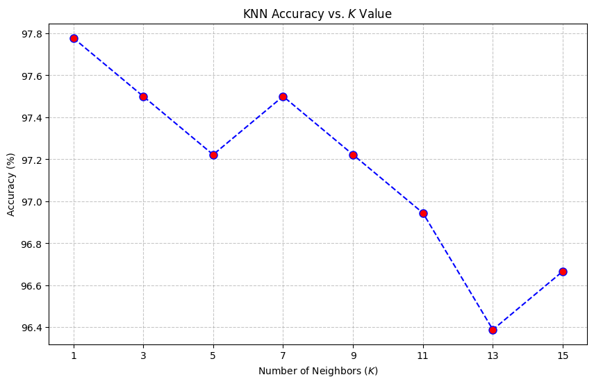
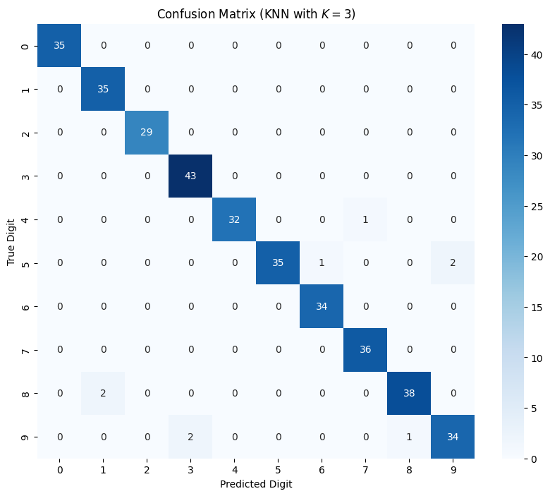
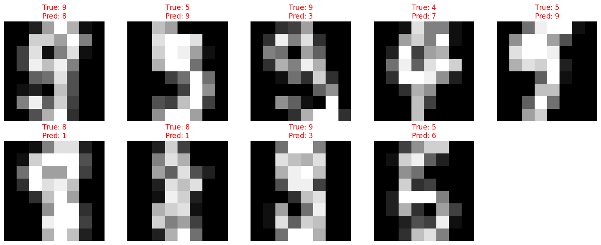

# K-Nearest Neighbors (KNN) from Scratch using NumPy

This repository demonstrates the implementation of the K-Nearest Neighbors (KNN) classification algorithm entirely from scratch using only NumPy. The model is evaluated on the standard Digits dataset.

## 🚀 Features

- **From Scratch Implementation:** No machine learning libraries (like scikit-learn) were used for the core KNN logic.
- **Vectorized Operations:** Heavily relies on NumPy for fast, vectorized mathematical operations like Euclidean distance calculation.
- **Hyperparameter Tuning:** Includes analysis to find the optimal number of neighbors ($K$).
- **Error Analysis:** Detailed confusion matrix and visualization of misclassified digits to understand model weaknesses.

## 🛠️ Tech Stack

- **Python 3.x**
- **NumPy:** Core library for math and array operations.
- **Matplotlib & Seaborn:** For data visualization, plotting accuracy, and generating the confusion matrix heatmap.
- **Scikit-learn:** ONLY used for loading the `digits` dataset and evaluating the metrics.

## 📊 Dataset

The model uses the `digits` dataset, which consists of $1797$ samples of hand-written digits ($0-9$). Each sample is an $8 \times 8$ image, flattened into a $64$-dimensional array for the algorithm.

## 📈 Results and Visualizations

The model achieves an accuracy of approximately **99%** on the test set when $K=1$ or $K=3$.

### 1. Accuracy vs. $K$ Value

Finding the optimal $K$ by testing odd numbers from $1$ to $15$:



### 2. Confusion Matrix

A heatmap showing the true labels vs. the model's predictions. Most errors are between visually similar digits (e.g., $3$ and $8$).



### 3. Misclassified Samples

Visualizing where the model failed to understand the context of the errors.



## 💻 How to Run

1. Clone the repository:
   ```bash
   git clone https://github.com/ErfanMasoudiBA/knn-from-scratch-numpy.git
   cd knn-from-scratch-numpy
   ```
2. Install the required dependencies:
   ```bash
   pip install -r requirements.txt
   ```
3. Run the Jupyter Notebook to see the step-by-step implementation and analysis:
   ```bash
   jupyter notebook notebooks/knn_digits_classification.ipynb
   ```

## 📂 Project Structure

```text
├── notebooks/
│   └── knn_digits_classification.ipynb   # Main notebook with code and analysis
├── src/
│   └── knn.py                            # The standalone KNN class
├── assets/                               # Images for README
├── requirements.txt                      # Project dependencies
├── README.md                             # Project documentation
└── .gitignore                            # Ignored files
```
## 📄 License

This project is licensed under the MIT License.

